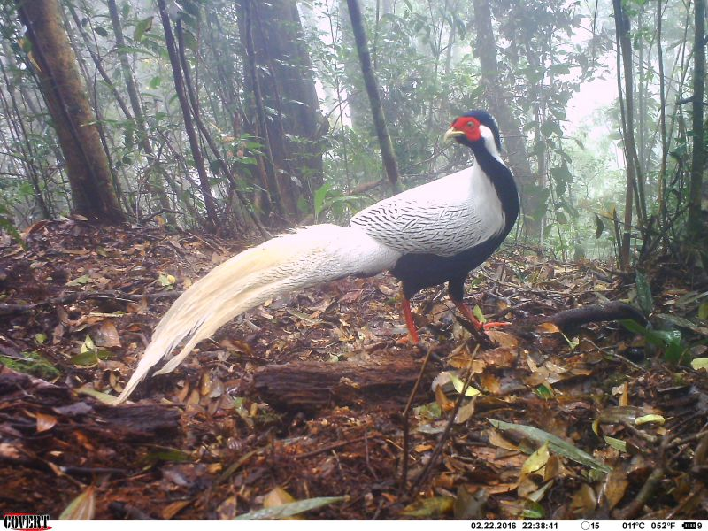

# Overview

Almost all the scripts in this directory create or operates on COCO Camera Traps databases, which are .json files structured as...

## COCO Camera Traps format

```
{
  "info" : info,
  "images" : [image],
  "categories" : [category],
  "annotations" : [annotation]
}

info 
{
  # Required
  "version" : str,
  "description" : str,
  
  # Optional
  "year" : int,
  "contributor" : str
  "date_created" : datetime
}

image
{
  # Required
  "id" : str,
  "file_name" : str,
  
  # Optional
  "width" : int,
  "height" : int,
  "rights_holder" : str,    
  "datetime": datetime,  
  "seq_id": str,
  "seq_num_frames": int,
  "frame_num": int
  
  # This is an int in older data sets, but convention is now strings
  "location": str,
  
  # Image corruption is quite common in camera trap images, and throwing out corrupt
  # images in database assembly is "dodging part of the problem".  Wherever possible,
  # use this flag to indicate that an image failed to load, e.g. in PIL and/or TensorFlow.
  "corrupt": bool
}

category
{
  # Required
  
  # Category ID 0 reserved for the class "empty"; all other categories vary by data
  # set.  Non-negative integers only.
  "id" : int,
  "name" : str  
}

annotation
{
  # Required
  "id" : str,
  "image_id" : str,  
  "category_id" : int,
  
  # Optional
  
  # These are in absolute, floating-point coordinates, with the origin at the upper-left
  "bbox": [x,y,width,height],
  
  # This indicates that this annotation is really applied at the *sequence* level,
  # and may not be reliable at the individual-image level.  Since the *sequences* are
  # the "atom of interest" for most ecology applications, this is common.
  "sequence_level_annotation" : bool
}
```

`seq_num_frames` is the total number of frames in the sequence that this image belongs to.

`frame_num` specifies this frame's order in the sequence.

Note that the coordinates in the `bbox` field are absolute here, different from those in the [batch processing API](api/batch_processing/README.md) output, which are relative.

Fields listed as "optional" are intended to standardize commonly-used parameters (such as date/time information).  When present, fields should follow the above conventions.  Additional fields may be present for specific data sets.

Whenever possible, the category ID 0 is associated with a class called "empty", even if there are no empty images in a data set.  When preparing data sets, we normalize all versions of "empty" (such as "none", "Empty", "no animal", etc.) to "empty".

# Contents

## Scripts in this folder

* [cct_json_utils.py](cct_json_utils.py) contains utilities for working with COCO Camera Traps .json databases
* [cct_to_wi.py](cct_to_wi.py) converts a COCO Camera Traps .json file to the [Wildlife Insights batch upload format](https://github.com/ConservationInternational/Wildlife-Insights----Data-Migration)
* [coco_to_yolo.py](coco_to_yolo.py) converts a COCO-formatted dataset to a YOLO-formatted dataset.
* [generate_crops_from_cct.py](generate_crops_from_cct.py) creates a cropped image for each bounding box in a CCT .json file
* [get_image_sizes.py](get_image_sizes.py) retrieves the image size for every image in a json-formatted list of filenames
* [read_exif.py](read_exif.py) reads EXIF/IPTC/XMP fields from all images in a folder, writing all that metadata to .json/.csv
* [remove_exif.py](remove_exif.py) removes EXIF/IPTC/XMP metadata from a folder of images
* [yolo_output_to_md_output.py](yolo_output_to_md_output.py) converts the output of YOLOv5's detect.py and val.py to the MD batch output format
* [yolo_to_coco.py](yolo_to_coco.py) converts a YOLO-formatted dataset to a COCO-formatted dataset.  Supports flat folders only.

## annotations

Code for creating new bounding box annotation tasks and converting annotations to COCO Camera Traps format.

## databases

Miscellaneous tools for manipulating COCO Camera Traps .json files.  Of particular note is `integrity_check_json_db.py`, which validates that a CCT database is well-formatted, optionally checking image existence and size.

## lila

Scripts for preparing data for upload to [LILA](https://lila.science), and working with LILA index files.

## importers

Code for converting frequently-used metadata formats (or sometimes one-off data sets) to COCO Camera Traps .json files.

# Gratuitous animal picture

<br/>Image credit Saola Working Group, from the [SWG Camera Traps](https://lila.science/datasets/swg-camera-traps/) data set.
